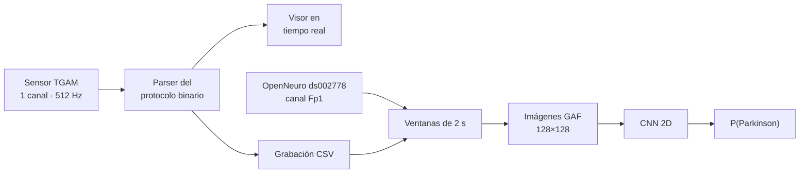

<div align="center">

<a href="https://github.com/AdolfoHMtz"></a>

<p>
  
  
  
  <a href="https://github.com/AdolfoHMtz/parkinson-eeg-tgam"></a>
  <a href="https://simuladorexam.vercel.app"></a>
</p>

</div>

### 🙋‍♂️ Sobre mí

Soy ingeniero de software con formación en **Ciencias de la Computación** (BUAP). Me gusta resolver problemas de punta a punta: entender qué necesita el usuario o el cliente, decidir la solución técnica, construirla y **medir con datos si de verdad funciona**.

| 💻 Ingeniería de software | 📊 Análisis de datos | 🧠 Deep learning |
|---|---|---|
| Diseño y desarrollo de productos full-stack, desde la arquitectura hasta el despliegue. Traduzco las necesidades del cliente en decisiones técnicas concretas. | Limpieza, procesamiento y análisis de datos con Python. Elijo métricas que no engañan y comunico los resultados junto con sus limitaciones. | Redes neuronales convolucionales (CNN) sobre señales biomédicas: procesamiento de EEG, imágenes GAF y evaluación por paciente. |

```ts
const adolfo = {
  ubicacion:     "Puebla, México 🇲🇽",
  formacion:     "Ing. en Ciencias de la Computación @ BUAP",
  trabaja:       "Galcex",
  roles:         ["Ingeniero de Software", "Analista de Datos", "Deep Learning"],
  investigacion: "CNN para detectar Parkinson con EEG de bajo costo (servicio social BUAP)",
  construyendo:  "SimsUni: simulacros de admisión universitaria",
  stack:         ["TypeScript", "Next.js", "React", "Angular", "Python", "TensorFlow"],
  buscando:      "proyectos de software, datos o IA para colaborar 🤝",
};
```

### 🛠️ Tecnologías

**Desarrollo web y móvil**

<p>
  
</p>

**Datos e inteligencia artificial**

<p>
  <br/>
  
  
  
  
  
  
  
  
</p>

**Herramientas**

<p>
  
</p>

---

### 🧠 Investigación: detección de Parkinson con EEG y redes neuronales

<a href="https://github.com/AdolfoHMtz/parkinson-eeg-tgam"></a>


Proyecto de mi **servicio social en la BUAP**, supervisado por el Mtro. Miguel Ángel Vargas Lomelí. Construí una plataforma de investigación de punta a punta para estudiar si un **EEG de un solo canal y bajo costo** (NeuroSky TGAM) contiene información que distinga a personas con Parkinson de controles sanos.



**Lo que hice**

- 🔌 **Hardware:** descifré el protocolo binario del sensor en Python (checksum y autodetección del puerto) y corregí errores del código de referencia del fabricante.
- 📈 **Visualización:** visor en tiempo real a 512 Hz con PyQt6 y PyQtGraph, validado en paralelo contra el software oficial MindView.
- 🧹 **Datos:** pipeline de preprocesamiento con ventanas, normalización e integración del dataset público OpenNeuro (31 personas), reducido al canal Fp1 para que sea comparable con el TGAM.
- 🖼️ **Modelo:** convertí la señal en imágenes **Gramian Angular Field (GAF)** y entrené una **CNN 2D** con focal loss y umbral calibrado en validación.
- 🔍 **Evaluación honesta:** detecté dos trampas que inflaban los resultados (un accuracy de 86 % que en realidad tenía un ROC AUC de 0.50, y fuga de datos al dividir por grabación en vez de por persona) y las corregí.

**Resultados** (evaluado en 5 personas que el modelo nunca vio, 1,355 ventanas de 2 s)

| ROC AUC | PR AUC | Balanced accuracy | Precisión | Recall | F1 |
|:---:|:---:|:---:|:---:|:---:|:---:|
| **0.899** | 0.924 | **0.831** | 0.887 | 0.806 | 0.844 |

<p align="center">
  
  
</p>

<sub>⚠️ Prototipo de investigación, no es un dispositivo médico. La cohorte es pequeña y el modelo aún no se valida con grabaciones TGAM de pacientes; los detalles y las limitaciones están en el <a href="https://github.com/AdolfoHMtz/parkinson-eeg-tgam">repositorio</a>.</sub>

`Python` · `TensorFlow/Keras` · `CNN` · `GAF` · `MNE` · `scikit-learn` · `PyQt6` · `PyQtGraph`

---

### 🏆 Producto: SimsUni

<a href="https://github.com/AdolfoHMtz/SimsUni"></a>

**[SimsUni](https://github.com/AdolfoHMtz/SimsUni)**: plataforma de simulacros de exámenes de admisión (EXANI, UNAM, IPN, UAM y College Board), con motor de examen cronometrado, calificación oficial, resultados en PDF, panel de moderación, importación de preguntas con IA y pagos con Stripe y Conekta. La llevé de la idea de negocio al despliegue: diseño, desarrollo full-stack y modelo freemium.

`Next.js` · `TypeScript` · `tRPC` · `Prisma` · `PostgreSQL` · `Tailwind` · `Vitest` &nbsp;→&nbsp; **[Probar la app 🚀](https://simuladorexam.vercel.app)**

### 🌟 Otros proyectos

| Proyecto | Descripción | Stack | Demo |
|---|---|---|---|
| [**Simulador de Sistemas Distribuidos**](https://github.com/AdolfoHMtz/ProjectSO2-simulators) | Simuladores interactivos de elección de líder y sincronización de relojes. | React · TypeScript · Vite | [Ver en vivo](https://proyectoso-eq8-simuladores.netlify.app) |
| [**PeliculasAPP**](https://github.com/AdolfoHMtz/PeliculasAPP) | App móvil de películas: detalles, categorías y búsqueda consumiendo una API externa. | Angular · Ionic | [Ver en vivo](https://peliculasappahm.netlify.app) |
| [**Gestión Académica**](https://github.com/AdolfoHMtz/app-movil-escolar-webapp) | Sistema escolar: usuarios, eventos académicos y gráficas. | Angular · Django REST | [Ver en vivo](https://app-movil-escolar-webapp-ahm.netlify.app) |
| [**TareAPP**](https://github.com/AdolfoHMtz/TareAPP) | Gestor de tareas móvil con validaciones y guardado local. | Angular · Ionic | [Ver en vivo](https://stately-longma-2938d1.netlify.app) |
| [**Calculadora Discreta**](https://github.com/AdolfoHMtz/Matematicas-Discretas) | Conjuntos, relaciones, combinatoria, aritmética modular y grafos. | React | [Ver en vivo](https://calculadoradiscreta-adolfohm.netlify.app) |
| [**Gestión de Memoria**](https://github.com/AdolfoHMtz/Memory-Management) | Simuladores de [particiones](https://github.com/AdolfoHMtz/Memory-Management) (First/Best Fit) y [paginación](https://github.com/AdolfoHMtz/Memory-Management-Pagination). | React · MUI | [Particiones](https://memory-management-perrines.netlify.app) · [Paginación](https://departamental-eq8.netlify.app) |
| [**Memorama**](https://github.com/AdolfoHMtz/Memorama) | Juego de memoria con personajes de Genshin Impact. | HTML · CSS · JS | [Jugar](https://memoramaahm.netlify.app) |
| [**APERRO**](https://github.com/AdolfoHMtz/Ing.Software) | App de emergencias médicas. | React · Express · MySQL | — |

### 📊 Estadísticas

<div align="center">
  
  
  <br/>
  
</div>

### 📫 Contacto

<p>
  <a href="https://github.com/AdolfoHMtz"></a>
  <!-- Descomenta y pon tu usuario real para mostrar LinkedIn:
  <a href="https://www.linkedin.com/in/TU-USUARIO"></a>
  -->
</p>

<div align="center">
  
</div>


